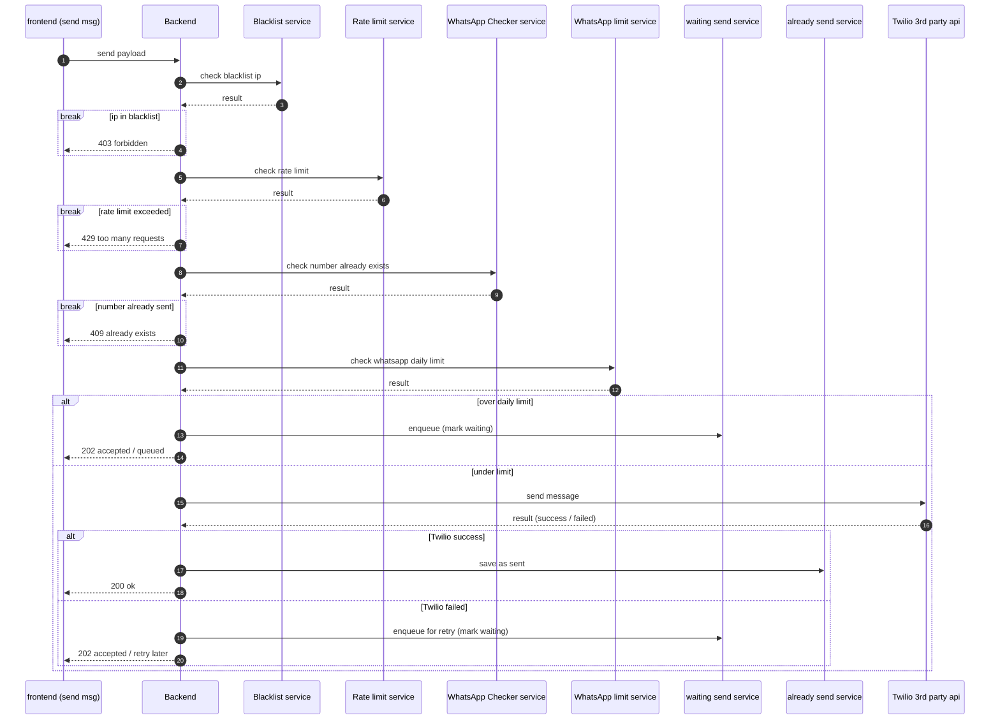

# WhatsApp Send — Sequence Flow

ระบบรับคำขอส่งข้อความจาก frontend แล้ว backend จะตรวจ guard หลายด่านตามลำดับ
(blacklist → rate limit → number exists) แบบ **เจอ fail แล้วหยุด (break)** จากนั้นด่าน
WhatsApp daily limit ใช้ **alt** เพราะ "เต็มโควตา" ไม่ใช่ error แต่จะเข้าคิวรอส่ง และ
ตอนยิงจริงผ่าน Twilio ก็เผื่อทั้งกรณีสำเร็จและล้มเหลว

## Participants

| ตัวย่อ | Service | หน้าที่ |
|--------|---------|--------|
| FE | frontend (send msg) | ผู้เริ่มคำขอ |
| BE | Backend | ตัวกลางที่ตรวจ guard และตัดสินใจ |
| BL | Blacklist service | เช็คว่า IP อยู่ใน blacklist ไหม |
| RL | Rate limit service | เช็ค rate limit |
| WC | WhatsApp Checker service | เช็คว่าเบอร์นี้เคยส่งไปแล้วหรือยัง |
| WL | WhatsApp limit service | เช็คโควตาส่งต่อวัน |
| WS | waiting send service | คิวพักข้อความ (ติด limit หรือ Twilio พลาด) รอ retry |
| AS | already send service | บันทึกข้อความที่ส่งสำเร็จแล้ว |
| TW | Twilio 3rd party api | ตัวยิงส่ง WhatsApp จริง (external) |

## Diagram (Mermaid)

## Flow (อ่านเป็นข้อ)

1. **FE → BE**: ส่ง payload เข้ามา
2. **Guard ด่านที่ 1 — Blacklist**: BE ถาม BL, ได้ผลกลับมา
   - ถ้า IP ติด blacklist → ตอบ `403 forbidden` แล้ว **จบ**
3. **Guard ด่านที่ 2 — Rate limit**: BE ถาม RL
   - ถ้าเกิน rate limit → ตอบ `429 too many requests` แล้ว **จบ**
4. **Guard ด่านที่ 3 — Number exists**: BE ถาม WC
   - ถ้าเบอร์นี้ส่งไปแล้ว → ตอบ `409 already exists` แล้ว **จบ**
5. **Guard ด่านที่ 4 — WhatsApp daily limit**: BE ถาม WL (ด่านนี้ใช้ `alt` ไม่ใช่ `break`)
   - **[over daily limit]** → เข้าคิว WS (mark waiting) → ตอบ `202 accepted / queued`
   - **[under limit]** → ยิงส่งจริงผ่าน TW แล้วเช็คผล:
     - **[Twilio success]** → บันทึกลง AS (save as sent) → ตอบ `200 ok`
     - **[Twilio failed]** → เข้าคิว WS เพื่อ retry → ตอบ `202 accepted / retry later`

## Notes

- ด่าน 1–3 เป็น `break` เพราะ "เจอปัญหา = ตีกลับ error แล้วจบ flow" ทันที
- ด่าน 4 (WhatsApp limit) เป็น `alt` เพราะ "เต็มโควตา" ไม่ได้จบ แต่ไป enqueue รอส่งต่อ
- `waiting send service` (WS) ถูกใช้ 2 กรณี: ติด daily limit และ Twilio ส่งพลาด — ทั้งคู่ไปกองที่คิวเดียวกัน
- **นอกขอบเขตไดอะแกรมนี้**: ข้อความในคิว WS จะถูก scheduler/cron ดึงไป retry ภายหลัง
  (แนะนำแยกเป็น sequence diagram อีกอันต่างหาก)
- การเปลี่ยน status (`waiting → sent`) ถือว่าเกิดภายในสเต็ป `save as sent` / `enqueue` อยู่แล้ว
  จึงไม่ต้องวาดเป็นสเต็ปแยก
